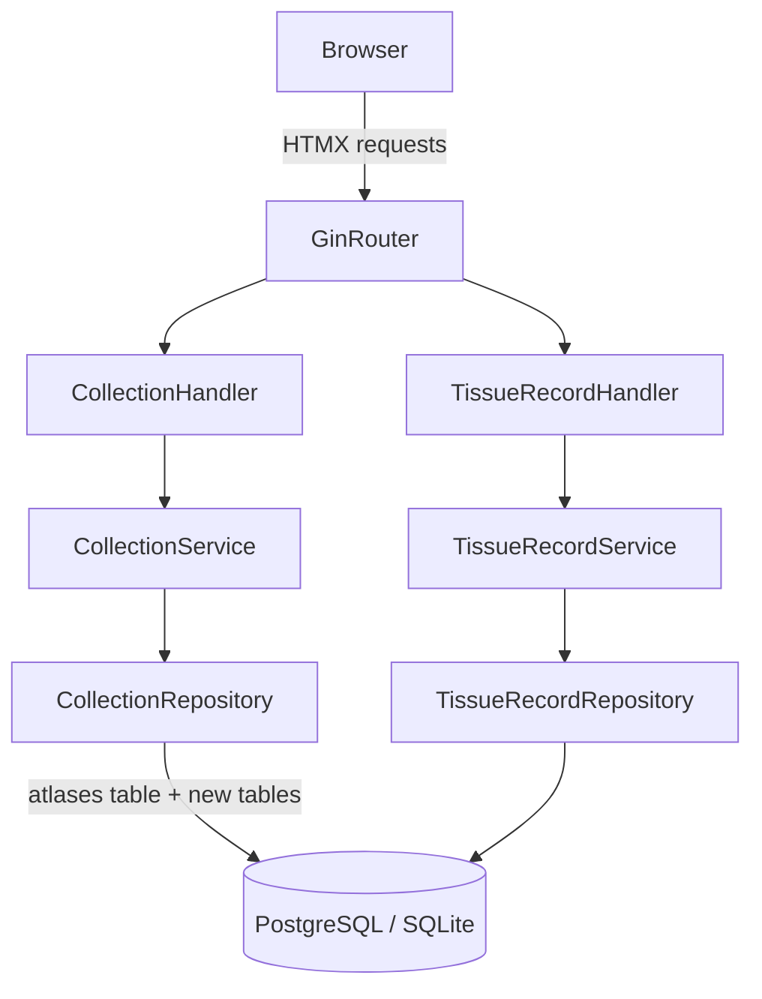
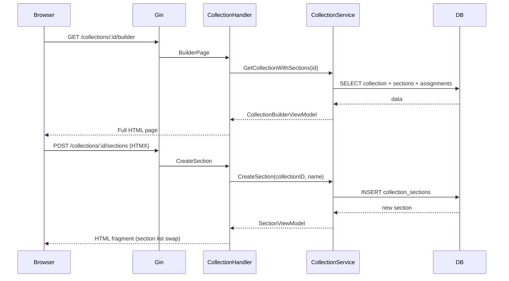
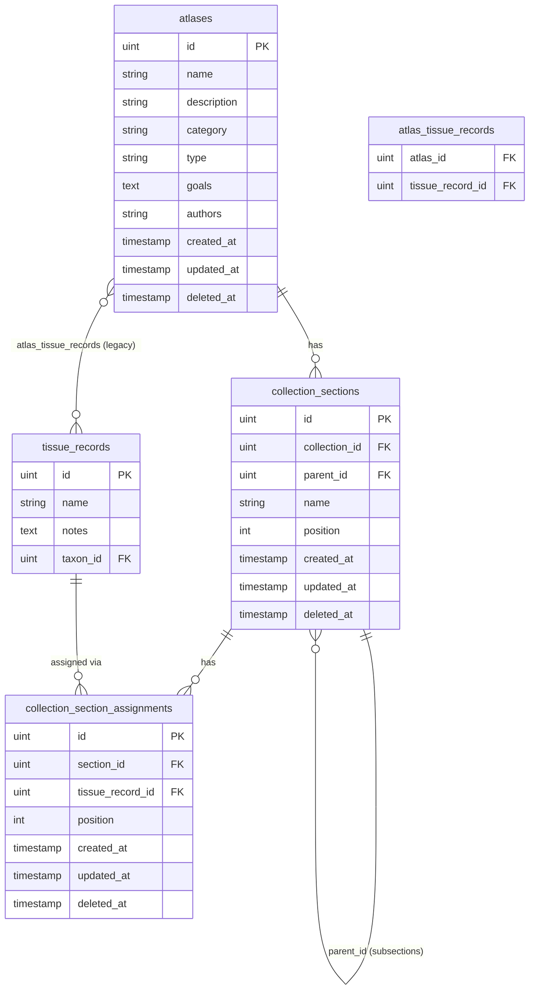

# Design Document: Collection Builder

## Overview

The Collection Builder generalizes TissQuest's existing `Atlas` concept into a broader `Collection` abstraction. A Collection is a named, curated grouping of tissue records with optional internal structure (sections and subsections up to two levels deep).

The design follows the existing codebase conventions: Go 1.24, Gin for HTTP routing, GORM for persistence, HTMX 2 for server-driven interactivity, Alpine.js 3 for lightweight client state, DaisyUI 5 for UI components, and PostgreSQL (production) / SQLite (development).

Key design principles:
- **Backward compatibility**: the `atlases` table is reused; only additive migrations are applied.
- **Incremental domain rename**: a new `internal/core/collection` package is introduced; the existing `atlas` package is kept as a thin compatibility shim during the transition.
- **HTMX-first interactivity**: all section management and tissue record assignment is driven by HTMX partial swaps, consistent with the existing workspace pattern.
- **No client-side framework additions**: Alpine.js handles only local UI state (modal open/close, dropdown toggles).

---

## Architecture



### Request Flow for the Builder Screen



---

## Components and Interfaces

### Domain Layer: `internal/core/collection`

New package replacing `internal/core/atlas` at the domain level.

```go
// Collection generalizes the Atlas concept.
type Collection struct {
    ID          uint
    Name        string
    Description string
    Goals       string
    Type        CollectionType  // "atlas" | "database" | "reference" | "other"
    Authors     string          // free-text, MVP
    Sections    []Section
    CreatedAt   time.Time
    UpdatedAt   time.Time
}

type CollectionType string

const (
    CollectionTypeAtlas     CollectionType = "atlas"
    CollectionTypeDatabase  CollectionType = "database"
    CollectionTypeReference CollectionType = "reference"
    CollectionTypeOther     CollectionType = "other"
)

// Section is a named, ordered subdivision of a Collection.
type Section struct {
    ID           uint
    CollectionID uint
    ParentID     *uint       // nil = top-level section; non-nil = subsection
    Name         string
    Position     int
    Assignments  []SectionAssignment
    Subsections  []Section
}

// SectionAssignment links a TissueRecord to a Section with an explicit position.
type SectionAssignment struct {
    ID             uint
    SectionID      uint
    TissueRecordID uint
    Position       int
}
```

Validation methods on `Collection`:
- `Validate() error` — enforces non-empty name, max 200 chars, valid type enum.

Validation methods on `Section`:
- `Validate() error` — enforces non-empty name, max depth 2.

### Repository Interface: `internal/core/collection`

```go
type RepositoryInterface interface {
    Save(c *Collection) (uint, error)
    Retrieve(id uint) (*Collection, error)
    Update(id uint, c *Collection) error
    Delete(id uint) error
    List() ([]Collection, error)

    // Section operations
    CreateSection(s *Section) (uint, error)
    UpdateSection(id uint, s *Section) error
    DeleteSection(id uint) error
    ReorderSections(collectionID uint, positions map[uint]int) error

    // Assignment operations
    CreateAssignment(a *SectionAssignment) (uint, error)
    DeleteAssignment(id uint) error
    ReorderAssignments(sectionID uint, positions map[uint]int) error
}
```

### Service Layer: `internal/services/collection_service.go`

```go
type CollectionService struct {
    repo collection.RepositoryInterface
}

// Key methods:
// CreateCollection, GetCollection, UpdateCollection, DeleteCollection, ListCollections
// CreateSection, RenameSection, DeleteSection, ReorderSections
// AssignTissueRecord, RemoveAssignment, ReorderAssignments
// SearchTissueRecords(query string) ([]tissuerecord.TissueRecord, error)
```

### HTTP Handler Layer: `cmd/api-server-gin/collections/`

New handler package with the following route handlers:

| Method | Path | Handler | Description |
|--------|------|---------|-------------|
| GET | /collections | ListCollections | Collections list page |
| GET | /collections/new | NewCollectionForm | Inline new-collection form fragment |
| POST | /collections | CreateCollection | Create and redirect |
| GET | /collections/:id/builder | BuilderPage | Full builder screen |
| GET | /collections/:id/edit | EditCollectionForm | Edit metadata form fragment |
| PUT | /collections/:id | UpdateCollection | Update metadata |
| DELETE | /collections/:id | DeleteCollection | Delete with cascade |
| POST | /collections/:id/sections | CreateSection | Create section, return fragment |
| PUT | /collections/:id/sections/:sid | UpdateSection | Rename section |
| DELETE | /collections/:id/sections/:sid | DeleteSection | Delete section + assignments |
| POST | /collections/:id/sections/:sid/reorder | ReorderSections | Persist new positions |
| POST | /collections/:id/sections/:sid/assignments | CreateAssignment | Assign tissue record |
| DELETE | /collections/:id/sections/:sid/assignments/:aid | DeleteAssignment | Remove assignment |
| POST | /collections/:id/sections/:sid/assignments/reorder | ReorderAssignments | Persist new positions |

Tissue record search (returns HTML fragment):

| Method | Path | Handler | Description |
|--------|------|---------|-------------|
| GET | /tissue_records/search | SearchTissueRecords | Search fragment for builder |

### Tissue Record Search Handler

Added to `cmd/api-server-gin/tissue_records/`:

```go
// GET /tissue_records/search?q=<term>&section_id=<id>
// Returns an HTML fragment listing matching tissue records with "Add" buttons.
func SearchTissueRecords(c *gin.Context)
```

---

## Data Models

### Modified: `AtlasModel` → extended in-place

The `atlases` table gains three new nullable columns via GORM `AutoMigrate` (additive only):

```go
type AtlasModel struct {
    gorm.Model
    Name          string
    Description   string
    Category      string          // preserved for backward compat
    Type          string          // new: "atlas" | "database" | "reference" | "other", default "atlas"
    Goals         string          // new: text field
    Authors       string          // new: free-text
    Categories    []CategoryModel `gorm:"many2many:atlas_categories;"`
    TissueRecords []TissueRecordModel `gorm:"many2many:atlas_tissue_records;..."`
    Sections      []CollectionSectionModel `gorm:"foreignKey:CollectionID"`
}
```

Default value for `type` is handled at the application layer: when reading an existing row with an empty `type`, the repository maps it to `"atlas"`.

### New: `CollectionSectionModel`

```go
type CollectionSectionModel struct {
    gorm.Model                          // id, created_at, updated_at, deleted_at
    CollectionID uint                   // FK → atlases.id
    ParentID     *uint                  // nullable FK → collection_sections.id (self-ref)
    Name         string
    Position     int
    Assignments  []CollectionSectionAssignmentModel `gorm:"foreignKey:SectionID"`
    Subsections  []CollectionSectionModel           `gorm:"foreignKey:ParentID"`
}

func (CollectionSectionModel) TableName() string { return "collection_sections" }
```

### New: `CollectionSectionAssignmentModel`

```go
type CollectionSectionAssignmentModel struct {
    gorm.Model                    // id, created_at, updated_at, deleted_at
    SectionID      uint           // FK → collection_sections.id
    TissueRecordID uint           // FK → tissue_records.id
    Position       int
}

func (CollectionSectionAssignmentModel) TableName() string {
    return "collection_section_assignments"
}
```

### Preserved: `atlas_tissue_records` join table

The existing many-to-many join table between `atlases` and `tissue_records` is preserved unchanged for backward compatibility. New section-based assignments use `collection_section_assignments` exclusively.

### Migration Registration

Both new models are added to `migration.RunMigration()`:

```go
db.AutoMigrate(
    // ... existing models ...
    &CollectionSectionModel{},
    &CollectionSectionAssignmentModel{},
)
```

### Entity Relationship Diagram



---

## UI Design

### Collections List Page (`/collections`)

Replaces `/atlases`. Displays a table with columns: Name, Type, Created At, Actions (View Builder, Delete). Includes a "New Collection" button that triggers an inline HTMX form swap (same pattern as existing atlas list).

### Collection Builder Page (`/collections/:id/builder`)

Single-screen layout with two panels:

```
┌─────────────────────────────────────────────────────────┐
│  Breadcrumb: Home > Collections > [Collection Name]      │
├──────────────────────┬──────────────────────────────────┤
│  METADATA PANEL      │  SECTIONS PANEL                  │
│  (left, ~30%)        │  (right, ~70%)                   │
│                      │                                  │
│  Name                │  [+ Add Section]                 │
│  Description         │                                  │
│  Goals               │  ▼ Section 1          [↑][↓][✕] │
│  Type (select)       │    ▼ Subsection 1.1   [↑][↓][✕] │
│  Authors             │      • TissueRecord A  [↑][↓][✕] │
│                      │      • TissueRecord B  [↑][↓][✕] │
│  [Save Metadata]     │      [Search / Add TR]           │
│                      │    [+ Add Subsection]            │
│                      │                                  │
│                      │  ▼ Section 2          [↑][↓][✕] │
│                      │    • TissueRecord C   [↑][↓][✕] │
│                      │    [Search / Add TR]             │
└──────────────────────┴──────────────────────────────────┘
```

Reordering uses up/down buttons (MVP). Each button fires an HTMX `POST` to the reorder endpoint and swaps the section list fragment.

### Tissue Record Search Fragment

Triggered by clicking "Search / Add TR" within a section. An HTMX `GET /tissue_records/search?q=&section_id=X` call renders a small search box + results list inline. Selecting a result fires `POST /collections/:id/sections/:sid/assignments`.

### Inline Tissue Record Creation Modal

An Alpine.js-controlled modal (`x-data="{ open: false }"`). The form inside uses `hx-post="/tissue_records"` with an additional hidden field `section_id` so the handler can create the assignment after persisting the tissue record. On success, HTMX swaps the section's assignment list.

---

## Correctness Properties

*A property is a characteristic or behavior that should hold true across all valid executions of a system — essentially, a formal statement about what the system should do. Properties serve as the bridge between human-readable specifications and machine-verifiable correctness guarantees.*

### Property Reflection

Before listing properties, redundancies are eliminated:

- 1.5 (create+retrieve round-trip) and 1.6 (update+retrieve round-trip) are combined into a single metadata persistence property.
- 2.1 (section position on create) and 2.5 (subsection position on create) are combined — both test the same "next available position" invariant.
- 2.3 (reorder sections) and 2.7 (reorder subsections) are combined — same reorder persistence property, parameterized by depth.
- 3.3 (reorder assignments) is combined with 2.3/2.7 into a general "reorder persists" property.
- 5.2 (inline form empty name) is subsumed by Property 1 (whitespace name rejection).
- 6.1 (general persistence) is subsumed by the round-trip properties.
- 6.4 (order preserved across reloads) is subsumed by the reorder persistence property.

---

### Property 1: Whitespace and empty names are rejected

*For any* string composed entirely of whitespace characters (including the empty string), attempting to create or update a Collection or Section with that string as the name SHALL be rejected by the domain validation layer, leaving the persisted state unchanged.

**Validates: Requirements 1.2, 2.2, 5.2**

---

### Property 2: Name length boundary enforcement

*For any* string whose length exceeds 200 characters, attempting to create or update a Collection with that string as the name SHALL be rejected by the domain validation layer.

**Validates: Requirements 1.3**

---

### Property 3: Collection type enum enforcement

*For any* string that is not one of `"atlas"`, `"database"`, `"reference"`, or `"other"`, attempting to create or update a Collection with that string as the type SHALL be rejected by the domain validation layer.

**Validates: Requirements 1.4**

---

### Property 4: Collection metadata round-trip

*For any* valid Collection metadata (name ≤ 200 chars, non-whitespace, valid type, arbitrary description/goals/authors), creating a Collection and then retrieving it by ID SHALL return a Collection whose fields are equal to the submitted values.

*For any* existing Collection, updating its metadata and then retrieving it SHALL return a Collection whose fields reflect the update.

**Validates: Requirements 1.5, 1.6, 6.1**

---

### Property 5: Section creation assigns next position

*For any* Collection with N existing sections (or subsections within a parent), creating a new section (or subsection) SHALL result in the new section having `position = N + 1` and being associated with the correct parent (Collection or Section).

**Validates: Requirements 2.1, 2.5**

---

### Property 6: Reorder persists new positions

*For any* Collection with N sections (or a Section with N subsections, or a Section with N assignments), applying a permutation of positions and saving SHALL result in the persisted order matching the requested permutation exactly when retrieved.

**Validates: Requirements 2.3, 2.7, 3.3, 6.4**

---

### Property 7: Section deletion removes all assignments

*For any* Section with an arbitrary set of Section Assignments, deleting the Section SHALL result in zero Section Assignments with that `section_id` remaining in the database.

**Validates: Requirements 2.4**

---

### Property 8: Assignment creation appends at end

*For any* Section with N existing assignments, assigning a new (non-duplicate) Tissue Record SHALL create a Section Assignment with `position = N + 1`.

**Validates: Requirements 3.1**

---

### Property 9: Duplicate assignment rejection

*For any* Section that already has a Section Assignment for Tissue Record T, attempting to assign T again to the same Section SHALL be rejected, and the number of assignments in that Section SHALL remain unchanged.

**Validates: Requirements 3.2**

---

### Property 10: Assignment removal resequences positions

*For any* Section with N assignments, removing the assignment at position K SHALL result in N-1 remaining assignments with positions forming a contiguous sequence 1..N-1 (no gaps).

**Validates: Requirements 3.4**

---

### Property 11: Search returns only matching records

*For any* search query string Q and any set of Tissue Records in the global pool, the search results SHALL contain only Tissue Records whose name or taxonomic classification contains Q as a case-insensitive substring. No non-matching records SHALL appear in the results.

**Validates: Requirements 4.2**

---

### Property 12: Inline creation persists record and creates assignment

*For any* valid Tissue Record data submitted via the inline creation form with an active Section, the operation SHALL result in: (a) a new Tissue Record existing in the global pool retrievable by ID, and (b) a Section Assignment linking that Tissue Record to the active Section.

**Validates: Requirements 5.3**

---

### Property 13: Collection deletion cascades

*For any* Collection with an arbitrary tree of Sections, Subsections, and Section Assignments, deleting the Collection SHALL result in zero Sections, Subsections, and Section Assignments referencing that Collection remaining in the database.

**Validates: Requirements 6.2**

---

### Property 14: Tissue Record deletion removes all assignments

*For any* Tissue Record T that is assigned to sections across one or more Collections, deleting T from the global pool SHALL result in zero Section Assignments with `tissue_record_id = T.ID` remaining in the database.

**Validates: Requirements 6.3**

---

### Property 15: Collection list rendering includes required fields

*For any* set of Collections in the database, the rendered Collections list SHALL include the name, type, and creation date for every Collection in the set.

**Validates: Requirements 7.1**

---

## Error Handling

| Scenario | HTTP Status | Response |
|----------|-------------|----------|
| Collection not found | 404 | Error page / HTMX error fragment |
| Section not found | 404 | HTMX error fragment |
| Validation failure (empty name, bad type, name too long) | 422 | Form fragment with inline error messages |
| Duplicate section assignment | 409 | HTMX info fragment ("already assigned") |
| Nesting depth exceeded (depth > 2) | 422 | HTMX error fragment |
| DB error | 500 | Error page |

All HTMX partial responses use `HX-Reswap` and `HX-Retarget` headers where needed to redirect error fragments to the correct DOM target. Flash notifications for successful saves use the existing `flash.go` mechanism.

---

## Testing Strategy

### Unit Tests

Unit tests cover domain validation logic in `internal/core/collection`:

- `Collection.Validate()` — empty name, whitespace name, name > 200 chars, invalid type, valid inputs.
- `Section.Validate()` — empty name, whitespace name.
- Depth enforcement — attempting to set `ParentID` on a section that is already a subsection.

Unit tests cover service-layer logic in `internal/services/collection_service.go`:

- `ReorderSections` / `ReorderAssignments` — position gap detection, contiguous resequencing after removal.
- `AssignTissueRecord` — duplicate detection.

### Property-Based Tests

Property-based tests use [**pgregory.net/rapid**](https://github.com/pgregory/rapid), a Go property-based testing library. Each test runs a minimum of 100 iterations.

Tests are located in `internal/core/collection/tests/` and `internal/services/tests/`.

Each test is tagged with a comment in the format:
`// Feature: collection-builder, Property N: <property text>`

**Property 1** — Whitespace name rejection
Generate arbitrary whitespace-only strings; call `collection.Validate()` and `section.Validate()`; assert error is returned.

**Property 2** — Name length boundary
Generate strings of length 201–500; call `collection.Validate()`; assert error is returned.

**Property 3** — Type enum enforcement
Generate arbitrary strings not in the valid set; call `collection.Validate()`; assert error is returned.

**Property 4** — Collection metadata round-trip
Generate valid Collection structs; save via repository (in-memory or SQLite test DB); retrieve by ID; assert field equality.

**Property 5** — Section creation assigns next position
Generate a Collection with 0–10 existing sections; call `CreateSection`; assert new section position = N+1 and correct parent association.

**Property 6** — Reorder persists new positions
Generate a list of N sections/assignments; generate a random permutation; call `ReorderSections`/`ReorderAssignments`; retrieve; assert persisted order matches permutation.

**Property 7** — Section deletion removes all assignments
Generate a Section with 0–20 assignments; call `DeleteSection`; query `collection_section_assignments` for that `section_id`; assert count = 0.

**Property 8** — Assignment creation appends at end
Generate a Section with 0–10 assignments; call `AssignTissueRecord`; assert new assignment position = N+1.

**Property 9** — Duplicate assignment rejection
Generate a Section with at least one assignment; attempt to assign the same tissue record again; assert error and count unchanged.

**Property 10** — Assignment removal resequences positions
Generate a Section with 2–10 assignments; remove one at a random index; retrieve remaining; assert positions are 1..N-1 with no gaps.

**Property 11** — Search returns only matching records
Generate a pool of tissue records with random names/taxa; generate a random query string; call `SearchTissueRecords`; assert every result contains the query as a case-insensitive substring in name or taxon name.

**Property 12** — Inline creation persists record and creates assignment
Generate valid tissue record data and a target section; call the inline creation service method; assert tissue record exists in pool and assignment exists in section.

**Property 13** — Collection deletion cascades
Generate a Collection with a random tree of sections and assignments; call `DeleteCollection`; assert zero sections and assignments remain for that collection ID.

**Property 14** — Tissue record deletion removes all assignments
Generate multiple collections with assignments to a shared tissue record; delete the tissue record; assert zero assignments remain with that `tissue_record_id`.

**Property 15** — Collection list rendering includes required fields
Generate a random set of Collections; call the list rendering function; assert each collection's name, type, and creation date appear in the output.

### Integration Tests

- Verify `AutoMigrate` adds `type`, `goals`, `authors` columns to `atlases` without dropping existing columns.
- Verify existing Atlas rows default to `type = "atlas"` after migration.
- Verify `collection_sections` and `collection_section_assignments` tables are created.
- End-to-end HTTP test: POST `/collections` → GET `/collections/:id/builder` → POST section → POST assignment → DELETE collection; assert cascade.

### Smoke Tests

- Application starts and migration completes without error.
- `atlases` table retains all pre-existing columns after migration.
- `authors` field on `atlases` accepts arbitrary string values.
