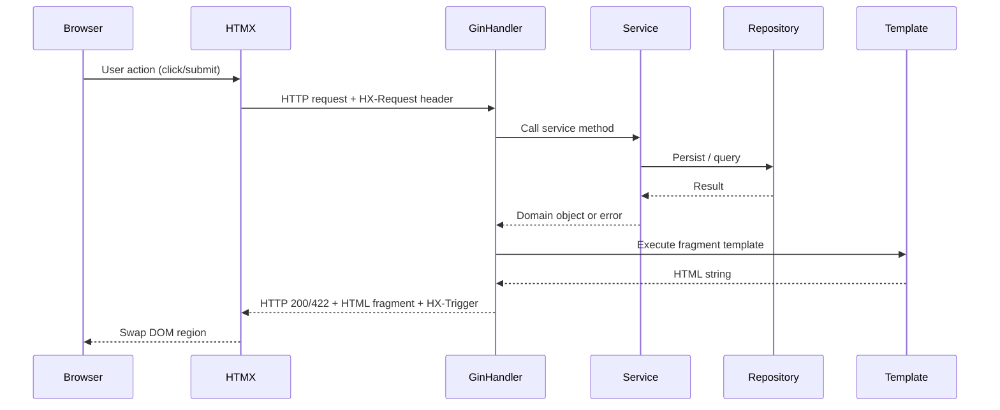

# Design Document: CRUD UI

## Overview

This document describes the technical design for adding full CRUD capabilities to the TissQuest web interface. The feature covers Atlas, TissueRecord, Slide, Taxon, and Category entities. All interactions follow an HTMX/HATEOAS model: the server returns HTML fragments that embed the next available actions as `hx-*` attributes, driving all state transitions without a JavaScript framework.

The existing codebase uses Go + Gin with server-side Go templates, DaisyUI + Tailwind for styling, and GORM for persistence (SQLite in dev, PostgreSQL in prod). The current handlers return JSON; this feature converts them to return HTML and adds the missing CRUD routes.

Key design decisions:
- Handlers detect the `HX-Request` header to return either a full page layout or a bare fragment.
- Validation errors return HTTP 422 + the form fragment with inline error messages.
- Successful mutations return HTTP 200 + a replacement fragment + `HX-Trigger: showFlash` header.
- OOB swaps (`hx-swap-oob="true"`) update the flash message region alongside the primary swap target in a single response.
- The delete confirmation flow is a two-step inline swap: first load a `Confirmation_Snippet`, then execute the delete.

---

## Architecture

The feature follows the existing hexagonal architecture:

```
cmd/api-server-gin/{entity}/   ← HTTP handlers (Gin), template rendering
internal/services/             ← Business logic, validation orchestration
internal/core/{entity}/        ← Domain models, domain validation
internal/persistence/          ← GORM repositories
web/templates/                 ← Go HTML templates (pages + fragments)
```

### Request Flow



### Full Page vs Fragment Detection

Every handler checks `c.GetHeader("HX-Request")`. If `"true"`, it executes only the content template (fragment). Otherwise it wraps it in `base.html` for a full page response.

```go
func isHTMX(c *gin.Context) bool {
    return c.GetHeader("HX-Request") == "true"
}

func renderPage(c *gin.Context, templateName string, data gin.H) {
    if isHTMX(c) {
        renderFragment(c, templateName, data)
    } else {
        renderFullPage(c, templateName, data)
    }
}
```

---

## Components and Interfaces

### New Routes

The following routes are added to `cmd/api-server-gin/main.go`:

```
GET    /atlases                       → atlas.ListAtlases (HTML)
GET    /atlases/new                   → atlas.NewAtlasForm
POST   /atlases                       → atlas.CreateAtlas (HTML)
GET    /atlases/:id/edit              → atlas.EditAtlasForm
PUT    /atlases/:id                   → atlas.UpdateAtlas (HTML)
DELETE /atlases/:id                   → atlas.DeleteAtlas (HTML)
GET    /atlases/:id/confirm-delete    → atlas.ConfirmDeleteAtlas

GET    /tissue_records                → tissue_records.ListTissueRecords (HTML)
GET    /tissue_records/new            → tissue_records.NewTissueRecordForm
POST   /tissue_records                → tissue_records.CreateTissueRecord (HTML)
GET    /tissue_records/:id            → tissue_records.ViewTissueRecord
GET    /tissue_records/:id/edit       → tissue_records.EditTissueRecordForm
PUT    /tissue_records/:id            → tissue_records.UpdateTissueRecord (HTML)
DELETE /tissue_records/:id            → tissue_records.DeleteTissueRecord (HTML)
GET    /tissue_records/:id/confirm-delete → tissue_records.ConfirmDeleteTissueRecord

POST   /tissue_records/:id/slides     → slides.CreateSlide (HTML)
GET    /slides/:id/edit               → slides.EditSlideForm
PUT    /slides/:id                    → slides.UpdateSlide (HTML)
DELETE /slides/:id                    → slides.DeleteSlide (HTML)
GET    /slides/:id/confirm-delete     → slides.ConfirmDeleteSlide

GET    /taxa                          → taxa.ListTaxa (HTML)
GET    /taxa/new                      → taxa.NewTaxonForm
POST   /taxa                          → taxa.CreateTaxon (HTML)
GET    /taxa/:id/edit                 → taxa.EditTaxonForm
PUT    /taxa/:id                      → taxa.UpdateTaxon (HTML)
DELETE /taxa/:id                      → taxa.DeleteTaxon (HTML)
GET    /taxa/:id/confirm-delete       → taxa.ConfirmDeleteTaxon

GET    /categories                    → categories.ListCategories (HTML)
GET    /categories/new                → categories.NewCategoryForm
POST   /categories                    → categories.CreateCategory (HTML)
GET    /categories/:id/edit           → categories.EditCategoryForm
PUT    /categories/:id                → categories.UpdateCategory (HTML)
DELETE /categories/:id                → categories.DeleteCategory (HTML)
GET    /categories/:id/confirm-delete → categories.ConfirmDeleteCategory
```

### Handler Package Structure

New handler packages are added under `cmd/api-server-gin/`:

```
cmd/api-server-gin/
  atlas/
    atlas.go          ← existing (convert to HTML)
    atlas_view.go     ← existing
    atlas_crud.go     ← new: Create/Update/Delete/Forms
  tissue_records/
    tissue_records.go ← existing (convert to HTML)
    tissue_record_crud.go ← new
  slides/
    slides.go         ← existing (image upload)
    slides_crud.go    ← new: Create/Update/Delete/Forms
  taxa/
    taxa.go           ← new package
  categories/
    categories.go     ← new package
  shared/
    render.go         ← shared renderPage/renderFragment/renderError helpers
    flash.go          ← setFlash(c, message) helper
```

### Shared Render Helpers (`cmd/api-server-gin/shared/`)

```go
// render.go
func RenderPage(c *gin.Context, templates []string, templateName string, data gin.H)
func RenderFragment(c *gin.Context, templates []string, templateName string, data gin.H)
func RenderError(c *gin.Context, status int, message string)
func IsHTMX(c *gin.Context) bool

// flash.go
// SetFlash sets the HX-Trigger header to emit a showFlash browser event.
func SetFlash(c *gin.Context, message string)
```

`SetFlash` encodes the message as JSON in the `HX-Trigger` header:
```
HX-Trigger: {"showFlash": "Atlas created successfully"}
```

### New Services

Two new services are needed:

```go
// internal/services/taxon_service.go
type TaxonService struct { repo taxon.RepositoryInterface }
func (s *TaxonService) Create(t *taxon.Taxon) (uint, error)
func (s *TaxonService) GetByID(id uint) (*taxon.Taxon, error)
func (s *TaxonService) Update(id uint, t *taxon.Taxon) error
func (s *TaxonService) Delete(id uint) error
func (s *TaxonService) List() ([]taxon.Taxon, error)
func (s *TaxonService) ListByRank(rank taxon.Rank) ([]taxon.Taxon, error)

// internal/services/category_service.go
type CategoryService struct { repo category.RepositoryInterface }
func (s *CategoryService) Create(cat *category.Category) (uint, error)
func (s *CategoryService) GetByID(id uint) (*category.Category, error)
func (s *CategoryService) Update(id uint, cat *category.Category) error
func (s *CategoryService) Delete(id uint) error
func (s *CategoryService) List() ([]category.Category, error)
```

A `SlideService` is extended to support CRUD (currently only handles image upload):

```go
// internal/services/slide_service.go (extended)
func (s *SlideService) Create(tissueRecordID uint, sl *slide.Slide) (uint, error)
func (s *SlideService) GetByID(id uint) (*slide.Slide, error)
func (s *SlideService) Update(id uint, sl *slide.Slide) error
func (s *SlideService) Delete(id uint) error
func (s *SlideService) ListByTissueRecord(tissueRecordID uint) ([]slide.Slide, error)
```

### Domain Model Extensions

`slide.Slide` needs an `ID` field and a `TissueRecordID` for repository operations:

```go
// internal/core/slide/slide.go
type Slide struct {
    ID             uint
    TissueRecordID uint
    Name           string
    Url            string
    Magnification  int
    Preparation    Preparation
}

var (
    ErrEmptyName          = errors.New("slide name cannot be empty")
    ErrInvalidMagnification = errors.New("magnification must be a positive integer")
)

func (s *Slide) Validate() error { ... }
```

`taxon.Taxon` needs a `Validate()` method:

```go
// internal/core/taxon/taxon.go
var (
    ErrEmptyName    = errors.New("taxon name cannot be empty")
    ErrInvalidRank  = errors.New("invalid taxon rank")
)

func (t *Taxon) Validate() error { ... }
```

### Repository Extensions

A `SlideRepository` interface and GORM implementation are added:

```go
// internal/core/slide/repository_interface.go
type RepositoryInterface interface {
    Save(sl *Slide) (uint, error)
    GetByID(id uint) (*Slide, error)
    Update(id uint, sl *Slide) error
    Delete(id uint) error
    ListByTissueRecord(tissueRecordID uint) ([]Slide, error)
}
```

The `taxon.RepositoryInterface` already exists. A GORM implementation (`gorm_taxon_repository.go`) is added to the repositories package.

---

## Data Models

### Template Data Structures

Each handler passes a typed view model to the template:

```go
// Atlas list page
type AtlasListData struct {
    Title   string
    Atlases []atlas.Atlas
}

// Atlas form (create and edit)
type AtlasFormData struct {
    Atlas  *atlas.Atlas  // nil for create, populated for edit
    Errors map[string]string
}

// TissueRecord list page
type TissueRecordListData struct {
    Title          string
    TissueRecords  []tissuerecord.TissueRecord
    Page           int
    TotalPages     int
    Taxa           []taxon.Taxon  // for taxon selector in create form
}

// TissueRecord detail page (includes slide gallery)
type TissueRecordDetailData struct {
    Title         string
    TissueRecord  tissuerecord.TissueRecord
    Slides        []slide.Slide
}

// Slide form
type SlideFormData struct {
    Slide          *slide.Slide
    TissueRecordID uint
    Errors         map[string]string
}

// Taxon list page
type TaxonListData struct {
    Title      string
    ByRank     map[taxon.Rank][]taxon.Taxon
    AllTaxa    []taxon.Taxon  // for parent selector
}

// Category list page
type CategoryListData struct {
    Title      string
    Categories []category.Category
    AllCategories []category.Category  // for parent selector
}
```

### Flash Message Encoding

The `HX-Trigger` header carries a JSON object:

```json
{"showFlash": {"message": "Atlas created successfully", "type": "success"}}
```

The flash region in the base layout listens for this event and renders the message.

### Pagination

TissueRecord list uses page size 20. The handler reads `?page=N` (default 1) and passes `Page` and `TotalPages` to the template for rendering pagination controls.

---

## Template Structure

```
web/templates/
  layouts/
    base.html              ← existing (add HTMX CDN + flash region)
  includes/
    main-menu.html         ← existing (add CRUD nav links)
    flash.html             ← new: flash message region
    breadcrumb.html        ← new: breadcrumb component
    confirm-delete.html    ← new: confirmation snippet
    delete-trigger.html    ← new: original delete button (for cancel restore)
  pages/
    atlas_list.html        ← new
    atlas_form.html        ← new (create + edit, driven by .Atlas nil check)
    tissue_record_list.html ← new
    tissue_record_form.html ← new
    tissue_record_detail.html ← new (replaces atlas_view for TR detail)
    slide_form.html        ← new
    taxon_list.html        ← new
    taxon_form.html        ← new
    category_list.html     ← new
    category_form.html     ← new
```

### Base Layout Changes

`base.html` gains:
1. HTMX CDN script tag.
2. A flash message region with a stable DOM ID (`id="flash-region"`).

```html
<script src="https://unpkg.com/htmx.org@2" defer></script>
...
<div id="flash-region"
     hx-on:show-flash="this.innerHTML = event.detail.message; setTimeout(()=>this.innerHTML='', 3000)">
</div>
```

### Fragment vs Full Page Template Convention

Each page template defines two named blocks:
- `"content"` — the page body (used for both full page and fragment rendering).
- The handler calls `ExecuteTemplate(w, "base", data)` for full pages and `ExecuteTemplate(w, "content", data)` for fragments.

---

## Correctness Properties

*A property is a characteristic or behavior that should hold true across all valid executions of a system — essentially, a formal statement about what the system should do. Properties serve as the bridge between human-readable specifications and machine-verifiable correctness guarantees.*

### Property 1: Successful mutations always set HX-Trigger

*For any* handler that performs a successful create, update, or delete operation, the HTTP response status SHALL be 200 and the `HX-Trigger` response header SHALL be present and non-empty.

**Validates: Requirements 1.3, 1.7, 1.9, 2.3, 2.6, 2.7, 3.3, 3.6, 3.7, 4.3, 4.6, 4.7, 5.3, 5.7, 5.8, 7.1, 9.8**

---

### Property 2: Invalid form submissions always return HTTP 422

*For any* form submission handler that receives data failing domain validation (empty required fields, values exceeding length limits, invalid enum values), the HTTP response status SHALL be 422 and the response body SHALL be a form fragment containing at least one inline error message.

**Validates: Requirements 1.4, 1.5, 1.8, 2.4, 3.4, 4.4, 5.4, 9.7**

---

### Property 3: HTMX requests receive fragments, direct requests receive full pages

*For any* page handler, when called with the `HX-Request: true` header the response body SHALL NOT contain `<html>`, `<head>`, or `<body>` tags. When called without that header the response body SHALL contain a complete HTML document with those tags.

**Validates: Requirements 9.2, 9.3**

---

### Property 4: Confirmation snippet contains both confirm and cancel actions

*For any* entity type and any existing entity ID, calling the `confirm-delete` endpoint SHALL return a fragment containing an element with `hx-delete` pointing to the resource URL and an element with `hx-get` pointing to the cancel/restore URL.

**Validates: Requirements 6.1, 6.2**

---

### Property 5: Cancel restores the original delete trigger

*For any* entity type and any existing entity ID, calling the cancel endpoint (the `hx-get` URL embedded in the Confirmation_Snippet) SHALL return a fragment that is structurally equivalent to the original delete trigger fragment for that entity.

**Validates: Requirements 6.3**

---

### Property 6: Successful mutation responses include an OOB flash swap

*For any* handler that performs a successful create, update, or delete operation, the response body SHALL contain an element with `hx-swap-oob="true"` targeting the flash message region (`id="flash-region"`), in addition to the primary swap fragment.

**Validates: Requirements 7.5, 9.6**

---

### Property 7: TissueRecord list pagination never exceeds page size

*For any* page number N ≥ 1 and any dataset size, the TissueRecord list handler SHALL return at most 20 TissueRecord rows in a single response.

**Validates: Requirements 2.1**

---

### Property 8: Circular parent reference is always rejected

*For any* category ID that already exists in the system, submitting a create or edit form with `ParentID` equal to that same ID SHALL return HTTP 422 with a fragment containing a circular reference error message.

**Validates: Requirements 5.5**

---

### Property 9: Taxon list groups taxa by rank

*For any* set of taxa stored in the system, the taxon list handler SHALL return HTML where each taxon appears under a heading or section corresponding to its rank, and no taxon appears under a rank other than its own.

**Validates: Requirements 4.1**

---

### Property 10: Error responses are fragments, not full pages

*For any* handler that returns an HTTP 4xx or 5xx status, the response body SHALL NOT contain `<html>`, `<head>`, or `<body>` tags, and SHALL contain a user-readable error message.

**Validates: Requirements 1.10, 2.8, 3.8, 4.8, 5.9, 9.10**

---

### Property 11: Form fragments always contain a cancel link with hx-get

*For any* create or edit form fragment returned by any handler, the fragment SHALL contain an element with an `hx-get` attribute pointing to a URL that restores the previous DOM state.

**Validates: Requirements 8.3**

---

## Error Handling

### Validation Errors (HTTP 422)

Domain validation is performed in the service layer using the existing `Validate()` methods on domain objects. When validation fails, the handler:
1. Populates an `Errors map[string]string` keyed by field name.
2. Re-renders the form fragment with the errors map.
3. Returns HTTP 422 so HTMX does not update the list or other page regions.

```go
func CreateAtlas(c *gin.Context) {
    var form AtlasFormInput
    c.ShouldBind(&form)

    a := &atlas.Atlas{Name: form.Name, Description: form.Description, Category: form.Category}
    id, err := atlasService.CreateAtlas(a)
    if err != nil {
        errors := mapValidationError(err)
        shared.RenderFragment(c, atlasFormTemplates, "atlas-form", gin.H{
            "Atlas":  a,
            "Errors": errors,
        })
        c.Status(http.StatusUnprocessableEntity)
        return
    }
    // success path...
}
```

### Not Found (HTTP 404)

When a repository returns `gorm.ErrRecordNotFound` (or equivalent), the handler returns a 404 fragment using `shared.RenderError`.

### Server Errors (HTTP 500)

Unexpected errors (DB connection failures, template execution errors) return a 500 fragment with a generic message. Panics are recovered by Gin's default recovery middleware.

### Form Binding

Gin's `ShouldBind` is used for form data (`application/x-www-form-urlencoded`). HTMX submits forms as URL-encoded by default. The `hx-encoding="multipart/form-data"` attribute is used only for the slide image upload endpoint.

---

## Testing Strategy

### Unit Tests

Unit tests cover:
- Domain model `Validate()` methods (atlas, taxon, category, slide).
- Service layer logic (validation orchestration, error mapping).
- Template rendering helpers (fragment vs full page detection).

These are example-based tests using Go's `testing` package. They focus on specific inputs and edge cases (empty names, names >100 chars, invalid ranks, circular parent IDs, non-integer magnification).

### Property-Based Tests

Property-based tests use [**rapid**](https://github.com/flyingmutant/rapid) (Go PBT library), configured to run a minimum of 100 iterations per property.

Each property test is tagged with a comment in the format:
```
// Feature: crud-ui, Property N: <property text>
```

Properties to implement as property-based tests:

| Property | Test description |
|---|---|
| P1 | Generate random valid entity inputs; call create/update/delete handler; assert HTTP 200 + HX-Trigger header present |
| P2 | Generate random invalid form inputs (empty names, oversized names, bad enums); call handler; assert HTTP 422 + error in body |
| P3 | For each handler, call with and without HX-Request header; assert fragment vs full page structure |
| P4 | For each entity type, generate random existing IDs; call confirm-delete; assert hx-delete + hx-get in response |
| P5 | For each entity type, call cancel endpoint; assert response matches original delete trigger fragment |
| P6 | Generate random valid inputs; call mutation handler; assert hx-swap-oob element in response body |
| P7 | Generate random page numbers and dataset sizes; call tissue record list; assert ≤20 rows in response |
| P8 | Generate random category IDs; submit form with parentID == that ID; assert HTTP 422 + circular error |
| P9 | Generate random sets of taxa with varying ranks; call taxon list; assert each taxon appears under its rank heading |
| P10 | For each handler, call with non-existent IDs; assert 4xx status + no html/head/body in response |
| P11 | For each form handler, call with any valid/invalid input; assert cancel link with hx-get in response |

### Integration Tests

Integration tests use a real SQLite in-memory database (`:memory:`) and the full Gin router. They verify:
- End-to-end create → list → edit → delete flows for each entity.
- OOB swap structure in combined responses.
- Pagination boundary conditions (exactly 20 records, 21 records spanning two pages).
- The HTMX CDN script tag is present in full page responses.

### Test File Locations

```
internal/core/atlas/atlas_test.go
internal/core/taxon/taxon_test.go
internal/core/category/category_test.go
internal/core/slide/slide_test.go
cmd/api-server-gin/atlas/atlas_crud_test.go
cmd/api-server-gin/tissue_records/tissue_record_crud_test.go
cmd/api-server-gin/slides/slides_crud_test.go
cmd/api-server-gin/taxa/taxa_test.go
cmd/api-server-gin/categories/categories_test.go
```
