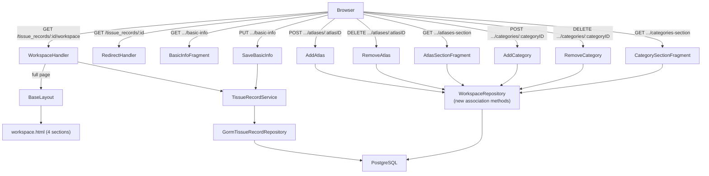
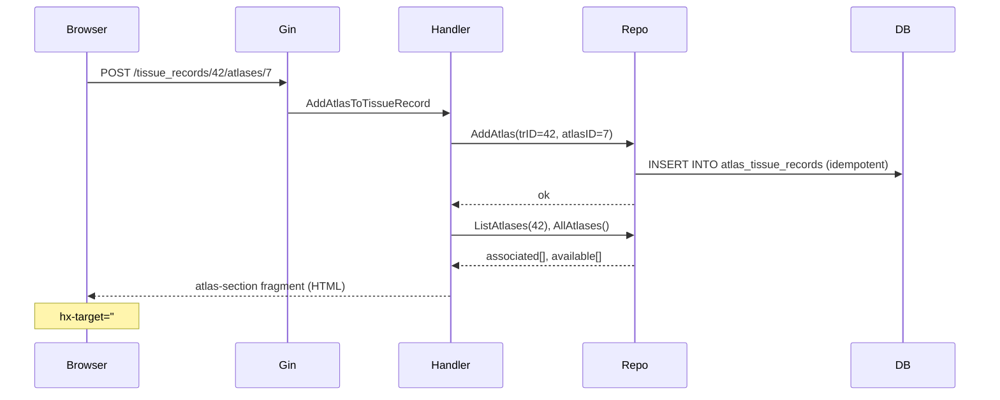

# Design Document: TissueRecord Workspace

## Overview

The TissueRecord Workspace is a dedicated management page that consolidates all four aspects of a TissueRecord — Basic Info, Slides, Atlas Associations, and Category Tags — into a single, independently-updatable hub. It replaces the old detail page and the inline row-edit pattern in the list.

The page is server-rendered with Go HTML templates. HTMX drives all server round-trips (form submissions, association add/remove, section refreshes). Alpine.js manages purely local UI state (toggling edit mode, opening/closing dropdowns) without any server involvement. DaisyUI + Tailwind CSS provide styling.

**Key design principle**: each of the four sections is a self-contained HTML fragment with its own HTMX target ID. An action in one section never touches another section's DOM node.

---

## Architecture



### Request Flow — Section Update



---

## Components and Interfaces

### Route Registration (additions to `main.go`)

```
GET  /tissue_records/:id                          → HTTP 301 → /tissue_records/:id/workspace
GET  /tissue_records/:id/workspace                → WorkspaceHandler (full page)
GET  /tissue_records/:id/workspace/basic-info     → BasicInfoFragment
PUT  /tissue_records/:id/workspace/basic-info     → SaveBasicInfo
POST /tissue_records/:id/atlases/:atlasID         → AddAtlasToTissueRecord
DELETE /tissue_records/:id/atlases/:atlasID       → RemoveAtlasFromTissueRecord
GET  /tissue_records/:id/atlases-section          → AtlasSectionFragment
POST /tissue_records/:id/categories/:categoryID   → AddCategoryToTissueRecord
DELETE /tissue_records/:id/categories/:categoryID → RemoveCategoryFromTissueRecord
GET  /tissue_records/:id/categories-section       → CategorySectionFragment
```

The existing `GET /tissue_records/:id` handler (`ViewTissueRecordHTML`) is replaced by a redirect handler.

### New Handler Package: `cmd/api-server-gin/tissue_records/workspace.go`

```go
// WorkspaceHandler — full page
func WorkspaceHandler(c *gin.Context)

// RedirectToWorkspace — 301 redirect from old detail URL
func RedirectToWorkspace(c *gin.Context)

// BasicInfoFragment — GET, returns display or edit fragment
func BasicInfoFragment(c *gin.Context)

// SaveBasicInfo — PUT, validates and persists, returns display fragment
func SaveBasicInfo(c *gin.Context)

// AddAtlasToTissueRecord — POST, idempotent add, returns atlas-section fragment
func AddAtlasToTissueRecord(c *gin.Context)

// RemoveAtlasFromTissueRecord — DELETE, returns atlas-section fragment
func RemoveAtlasFromTissueRecord(c *gin.Context)

// AtlasSectionFragment — GET, returns atlas-section fragment
func AtlasSectionFragment(c *gin.Context)

// AddCategoryToTissueRecord — POST, idempotent add, returns category-section fragment
func AddCategoryToTissueRecord(c *gin.Context)

// RemoveCategoryFromTissueRecord — DELETE, returns category-section fragment
func RemoveCategoryFromTissueRecord(c *gin.Context)

// CategorySectionFragment — GET, returns category-section fragment
func CategorySectionFragment(c *gin.Context)
```

### Extended Repository Interface

The `tissuerecord.RepositoryInterface` gains association methods. These are implemented on `GormTissueRecordRepository` using GORM's `Association` API against the existing join tables.

```go
// In internal/core/tissuerecord/repository_interface.go (additions)
type RepositoryInterface interface {
    // ... existing methods ...

    // Atlas associations (join table: atlas_tissue_records — already exists)
    AddAtlas(trID, atlasID uint) error
    RemoveAtlas(trID, atlasID uint) error
    ListAtlases(trID uint) ([]atlas.Atlas, error)

    // Category associations (join table: tissue_record_categories — already exists)
    AddCategory(trID, catID uint) error
    RemoveCategory(trID, catID uint) error
    ListCategories(trID uint) ([]category.Category, error)
}
```

> **Note**: Both join tables (`atlas_tissue_records` and `tissue_record_categories`) are already declared in the GORM migration models (`TissueRecordModel`, `AtlasModel`, `CategoryModel`). No new migration model is required. GORM's `AutoMigrate` will create the tables on next startup if they don't exist.

### Service Layer

`TissueRecordService` gains thin delegation methods for the new repository operations:

```go
func (s *TissueRecordService) AddAtlas(trID, atlasID uint) error
func (s *TissueRecordService) RemoveAtlas(trID, atlasID uint) error
func (s *TissueRecordService) ListAtlases(trID uint) ([]atlas.Atlas, error)
func (s *TissueRecordService) AddCategory(trID, catID uint) error
func (s *TissueRecordService) RemoveCategory(trID, catID uint) error
func (s *TissueRecordService) ListCategories(trID uint) ([]category.Category, error)
```

---

## Data Models

### Existing Join Tables (no schema changes needed)

| Table | Columns | Status |
|---|---|---|
| `atlas_tissue_records` | `atlas_id`, `tissue_record_id` | Exists — GORM model declared |
| `tissue_record_categories` | `tissue_record_id`, `category_id` | Exists — GORM model declared |

Both tables are already wired in `TissueRecordModel` via GORM `many2many` tags. The only gap is the absence of repository methods to manipulate them directly.

### Workspace View Model (passed to templates)

```go
type WorkspaceViewModel struct {
    TissueRecord  tissuerecord.TissueRecord
    Taxa          []taxon.Taxon
    Atlases       []atlas.Atlas       // currently associated
    AvailAtlases  []atlas.Atlas       // not yet associated
    Categories    []category.Category // currently associated
    AvailCats     []category.Category // not yet associated
    Crumbs        []breadcrumbItem
    Errors        map[string]string   // validation errors (basic-info fragment only)
}
```

Fragment handlers build a subset of this model — only the fields their template needs.

---

## Template Structure

```
web/templates/
  pages/
    tissue_record_workspace.html     ← full workspace page (4 sections)
  includes/
    workspace_basic_info.html        ← basic-info section fragment
    workspace_atlas_section.html     ← atlas section fragment
    workspace_category_section.html  ← category section fragment
    (slide_gallery.html reused as-is)
```

### Page Layout (`tissue_record_workspace.html`)

```
{{define "content"}}
<div class="min-h-screen bg-base-200">
  <div class="max-w-5xl mx-auto px-6 py-8 space-y-6">
    {{template "main-menu" .}}
    {{template "breadcrumb" .}}

    <h1>{{.TissueRecord.Name}}</h1>

    <!-- Two-column grid: 1/3 left, 2/3 right on desktop; single column on mobile -->
    <div class="grid grid-cols-1 lg:grid-cols-3 gap-6">

      <!-- Left column: Basic Info + Atlas + Category (stacked) -->
      <div class="lg:col-span-1 space-y-6">
        <div id="basic-info-section">
          {{template "workspace-basic-info" .}}
        </div>
        <div id="atlas-section">
          {{template "workspace-atlas-section" .}}
        </div>
        <div id="category-section">
          {{template "workspace-category-section" .}}
        </div>
      </div>

      <!-- Right column: Slide gallery (2/3 width) -->
      <div class="lg:col-span-2">
        <div id="slide-gallery">
          {{template "slide-gallery" .}}
        </div>
      </div>

    </div>
  </div>
</div>
{{end}}
```

### Basic Info Section (`workspace_basic_info.html`)

Alpine.js controls the display/edit toggle entirely client-side. HTMX handles the server round-trip on save and cancel.

```
{{define "workspace-basic-info"}}
<div class="card bg-base-100 shadow rounded-box p-6"
     x-data="{ editing: false }">

  <!-- Display view -->
  <div x-show="!editing">
    <h2>Basic Info</h2>
    <p>{{.TissueRecord.Name}}</p>
    <p>{{.TissueRecord.Notes}}</p>
    {{if .TissueRecord.Taxon}} ... {{end}}
    <button @click="editing = true" class="btn btn-primary btn-sm">Edit</button>
  </div>

  <!-- Edit form (Alpine shows/hides; HTMX submits) -->
  <div x-show="editing">
    <form hx-put="/tissue_records/{{.TissueRecord.ID}}/workspace/basic-info"
          hx-target="#basic-info-section"
          hx-swap="innerHTML">
      <!-- name, notes, taxon select -->
      <button type="submit" class="btn btn-primary btn-sm">Save</button>
      <button type="button" @click="editing = false"
              hx-get="/tissue_records/{{.TissueRecord.ID}}/workspace/basic-info"
              hx-target="#basic-info-section"
              hx-swap="innerHTML"
              class="btn btn-ghost btn-sm">Cancel</button>
    </form>
  </div>
</div>
{{end}}
```

On successful save, the server returns a fresh `workspace-basic-info` fragment with `editing: false` state (the Alpine component re-initialises). On validation failure, the server returns the fragment with the form visible and error messages.

### Atlas Section (`workspace_atlas_section.html`)

```
{{define "workspace-atlas-section"}}
<div class="card bg-base-100 shadow rounded-box p-6"
     x-data="{ showDropdown: false }">
  <h2>Atlases</h2>

  <!-- Associated atlases list -->
  {{range .Atlases}}
  <div class="flex items-center justify-between">
    <span>{{.Name}}</span>
    <button hx-delete="/tissue_records/{{$.TissueRecord.ID}}/atlases/{{.ID}}"
            hx-target="#atlas-section"
            hx-swap="innerHTML"
            class="btn btn-error btn-xs btn-outline">Remove</button>
  </div>
  {{end}}

  <!-- Add Atlas dropdown (hidden when no available atlases) -->
  {{if .AvailAtlases}}
  <div x-show="showDropdown">
    {{range .AvailAtlases}}
    <button hx-post="/tissue_records/{{$.TissueRecord.ID}}/atlases/{{.ID}}"
            hx-target="#atlas-section"
            hx-swap="innerHTML"
            @click="showDropdown = false">{{.Name}}</button>
    {{end}}
  </div>
  <button @click="showDropdown = !showDropdown"
          class="btn btn-primary btn-sm">+ Add Atlas</button>
  {{end}}
</div>
{{end}}
```

### Category Section (`workspace_category_section.html`)

Mirrors the Atlas section pattern with badge-style tags and a dropdown.

```
{{define "workspace-category-section"}}
<div class="card bg-base-100 shadow rounded-box p-6"
     x-data="{ showDropdown: false }">
  <h2>Categories</h2>

  <!-- Category tags -->
  <div class="flex flex-wrap gap-2">
    {{range .Categories}}
    <span class="badge badge-outline gap-1">
      {{.Name}}
      <button hx-delete="/tissue_records/{{$.TissueRecord.ID}}/categories/{{.ID}}"
              hx-target="#category-section"
              hx-swap="innerHTML">×</button>
    </span>
    {{end}}
  </div>

  <!-- Add Category dropdown -->
  {{if .AvailCats}}
  <div x-show="showDropdown">
    {{range .AvailCats}}
    <button hx-post="/tissue_records/{{$.TissueRecord.ID}}/categories/{{.ID}}"
            hx-target="#category-section"
            hx-swap="innerHTML"
            @click="showDropdown = false">{{.Name}}</button>
    {{end}}
  </div>
  <button @click="showDropdown = !showDropdown"
          class="btn btn-primary btn-sm">+ Add Category</button>
  {{end}}
</div>
{{end}}
```

### List Page Changes (`tr_row.html`)

Both View and Edit become plain anchor links to the workspace:

```html
<a href="/tissue_records/{{.ID}}/workspace" class="btn btn-ghost btn-sm">View</a>
<a href="/tissue_records/{{.ID}}/workspace" class="btn btn-ghost btn-sm">Edit</a>
```

The HTMX inline-edit button is removed from the row.

---

## Correctness Properties

*A property is a characteristic or behavior that should hold true across all valid executions of a system — essentially, a formal statement about what the system should do. Properties serve as the bridge between human-readable specifications and machine-verifiable correctness guarantees.*

### Property 1: Workspace page title equals record name

*For any* TissueRecord with any name, the workspace page handler must pass that name as the `Title` field in the template data, so the rendered page title equals the record's name.

**Validates: Requirements 1.2**

---

### Property 2: Breadcrumb structure is always correct

*For any* TissueRecord, the breadcrumb slice passed by the workspace handler must contain exactly three items: `{Label: "Home", URL: "/"}`, `{Label: "Tissue Records", URL: "/tissue_records"}`, and `{Label: record.Name}` (no URL on the last item).

**Validates: Requirements 1.3**

---

### Property 3: Basic info display fragment contains current values

*For any* TissueRecord with any combination of name, notes, and taxon, the `GET /tissue_records/:id/workspace/basic-info` handler must return an HTML fragment that contains the record's current name, notes, and taxon name.

**Validates: Requirements 2.1, 2.6**

---

### Property 4: Valid basic info save round-trip

*For any* non-empty name, any notes string, and any optional taxon ID, submitting `PUT /tissue_records/:id/workspace/basic-info` must persist those values and return a display fragment containing the new name and notes.

**Validates: Requirements 2.4**

---

### Property 5: Basic info update does not affect associations

*For any* TissueRecord with any set of atlas and category associations, performing a basic info update must leave the atlas associations and category associations unchanged (same count and same IDs before and after).

**Validates: Requirements 2.7**

---

### Property 6: Available atlases list is the complement of associated atlases

*For any* TissueRecord and any subset of atlases that are associated with it, the `AvailAtlases` list returned by the workspace handler must equal the set of all atlases minus the associated atlases (no overlap, no omissions).

**Validates: Requirements 4.2, 4.5**

---

### Property 7: Available categories list is the complement of associated categories

*For any* TissueRecord and any subset of categories that are associated with it, the `AvailCats` list returned by the workspace handler must equal the set of all categories minus the associated categories (no overlap, no omissions).

**Validates: Requirements 5.2, 5.5**

---

### Property 8: Category association add is idempotent

*For any* TissueRecord ID and Category ID, calling `AddCategory(trID, catID)` any number of times (N ≥ 1) must result in exactly one entry for that category in `ListCategories(trID)` — no duplicates, no error on repeat calls.

**Validates: Requirements 6.3**

---

### Property 9: Atlas association add is idempotent

*For any* TissueRecord ID and Atlas ID, calling `AddAtlas(trID, atlasID)` any number of times (N ≥ 1) must result in exactly one entry for that atlas in `ListAtlases(trID)` — no duplicates, no error on repeat calls.

**Validates: Requirements 7.3**

---

### Property 10: Category association round-trip (add then list)

*For any* TissueRecord ID and Category ID, after calling `AddCategory(trID, catID)`, the result of `ListCategories(trID)` must contain a category with that ID.

**Validates: Requirements 6.1, 6.4**

---

### Property 11: Category association round-trip (remove then list)

*For any* TissueRecord ID and Category ID that is currently associated, after calling `RemoveCategory(trID, catID)`, the result of `ListCategories(trID)` must not contain a category with that ID.

**Validates: Requirements 6.2**

---

### Property 12: Atlas association round-trip (add then list)

*For any* TissueRecord ID and Atlas ID, after calling `AddAtlas(trID, atlasID)`, the result of `ListAtlases(trID)` must contain an atlas with that ID.

**Validates: Requirements 7.1, 7.4**

---

### Property 13: Atlas association round-trip (remove then list)

*For any* TissueRecord ID and Atlas ID that is currently associated, after calling `RemoveAtlas(trID, atlasID)`, the result of `ListAtlases(trID)` must not contain an atlas with that ID.

**Validates: Requirements 7.2**

---

### Property 14: Old detail URL redirects to workspace for any valid ID

*For any* valid TissueRecord ID, a `GET /tissue_records/:id` request must return HTTP 301 with a `Location` header of `/tissue_records/:id/workspace`.

**Validates: Requirements 8.3**

---

**Property Reflection — Redundancy Check:**

- Properties 10 and 12 (add→list round-trips) are distinct from Properties 8 and 9 (idempotence) — they test different things: presence vs. uniqueness. Both are kept.
- Properties 3 and 4 are distinct: Property 3 tests the GET (cancel/display path), Property 4 tests the PUT (save path). Both are kept.
- Properties 6 and 7 are structurally identical but for different entity types (atlases vs. categories). Both are kept as they test different repository paths.
- Properties 5 covers section independence for basic-info updates. The same independence invariant applies to atlas and category operations but is implied by the section-scoped HTMX targets (architectural constraint, not a repository-level property). Property 5 is the most valuable to test at the repository level.

---

## Error Handling

| Scenario | Handler Behaviour |
|---|---|
| Invalid or non-existent `:id` | `shared.RenderError(c, 404, "Tissue record not found")` |
| Invalid `:atlasID` or `:categoryID` path param | `shared.RenderError(c, 400, "Invalid ID")` |
| Empty name on basic-info PUT | HTTP 422, return basic-info fragment with `Errors["name"]` set |
| Atlas/category not found during add | HTTP 404, return section fragment with flash error |
| DB error on association add/remove | HTTP 500, `shared.RenderError` |
| Duplicate association add | Silently idempotent — no error, return refreshed section |

Fragment handlers (HTMX targets) return HTML fragments even on errors where possible, so HTMX can swap the error message into the correct section without a full page reload.

---

## Testing Strategy

### Unit Tests

Focus on specific examples and edge cases:

- `WorkspaceHandler` returns 404 for non-existent ID
- `WorkspaceHandler` returns 301 redirect from old detail URL
- `SaveBasicInfo` returns 422 with error fragment when name is empty
- `SaveBasicInfo` returns 200 with display fragment when name is valid
- `tr_row` template renders View and Edit as `<a>` links to `/tissue_records/:id/workspace`
- Breadcrumb slice has correct structure for a known record

### Property-Based Tests

Use [**gopter**](https://github.com/leanovate/gopter) (Go property-based testing library). Each test runs a minimum of **100 iterations**.

Tag format: `// Feature: tissuerecord-workspace, Property N: <property text>`

**Repository-level properties** (in-memory or test DB, no HTTP):

| Property | Test description |
|---|---|
| P8: Category add idempotent | Generate random (trID, catID), call AddCategory 1–5 times, assert ListCategories count for that catID == 1 |
| P9: Atlas add idempotent | Same pattern for AddAtlas / ListAtlases |
| P10: Category add→list | Generate (trID, catID), AddCategory, assert catID in ListCategories |
| P11: Category remove→list | Generate associated (trID, catID), RemoveCategory, assert catID not in ListCategories |
| P12: Atlas add→list | Generate (trID, atlasID), AddAtlas, assert atlasID in ListAtlases |
| P13: Atlas remove→list | Generate associated (trID, atlasID), RemoveAtlas, assert atlasID not in ListAtlases |

**Handler-level properties** (using `httptest`, mock services):

| Property | Test description |
|---|---|
| P1: Title equals name | Generate random record names, call WorkspaceHandler, assert template data Title == name |
| P2: Breadcrumb structure | Generate random record names, assert breadcrumb slice structure |
| P3: Basic info display | Generate random (name, notes, taxon), call BasicInfoFragment, assert fragment contains those values |
| P4: Basic info save round-trip | Generate valid (name, notes), PUT to SaveBasicInfo, assert returned fragment contains new values |
| P6: Available atlases complement | Generate random atlas sets and association subsets, assert AvailAtlases == all - associated |
| P7: Available categories complement | Same pattern for categories |
| P14: Redirect for any valid ID | Generate random valid IDs, assert GET /tissue_records/:id returns 301 to /tissue_records/:id/workspace |

**Unit tests cover** edge cases P5 (section independence), P8/P9 boundary (N=0 calls), and all error conditions from the Error Handling table.
